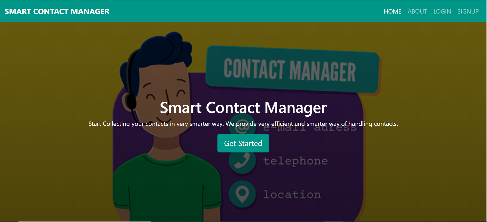
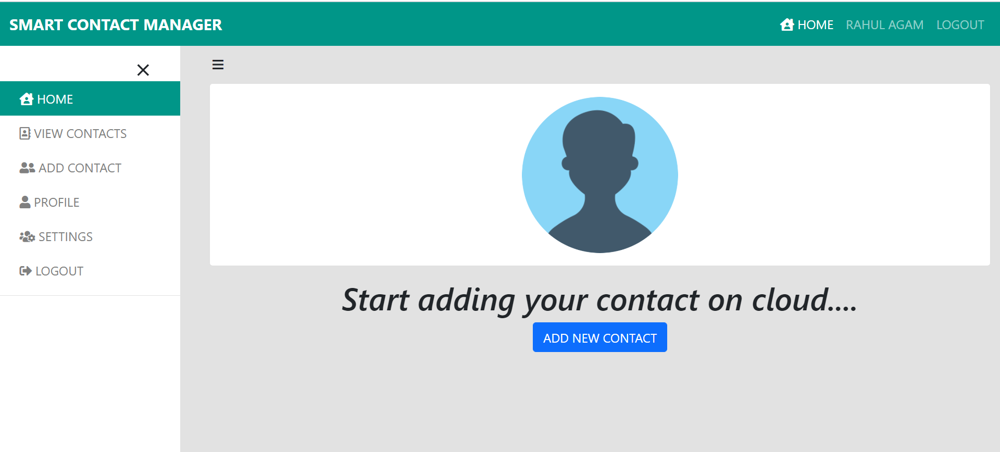
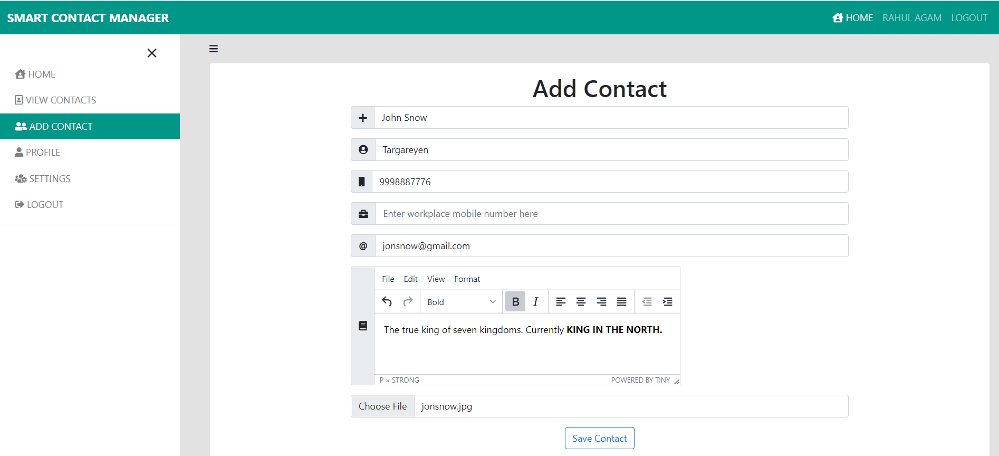
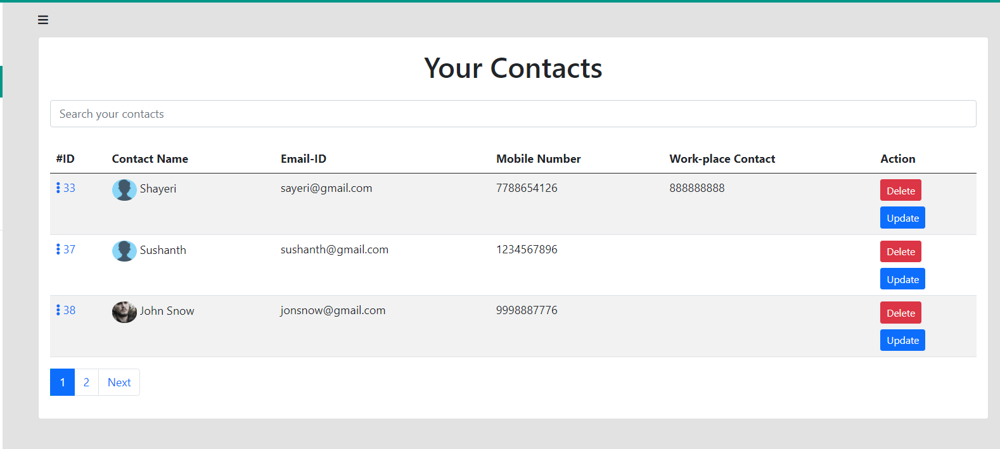
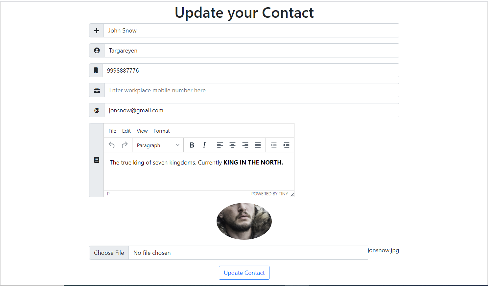

# SMART CONTACT MANAGER

  Smart Contact Manager is a contact management tool built using <strong><i>Spring Boot</i></strong>. User can perform CRUD operations on his contacts list.
  User authentication is done using <strong><i>Spring Security</i></strong>. I have used <strong><i>MySQL</i></strong> database to store contacts and user information.
  <strong><i>Spring Data JPA</i></strong> is used to access the data from database.
 

 

  A user can add new contacts, update existing contacts, view and search contacts and can also delete the contacts.
 

# Tech Stack
<ul>
  <li>Spring Boot</li>
  <li>Spring Security</li>
  <li>Spring Data JPA</li>
  <li>Thymeleaf</li>
</ul>

# Output 
<b>Home Page</b> 

<b> User Dashboard </b> 

<b>Add Contact Form</b> 

<b>View Contacts</b> 

<b> Update Contact Form</b> 

